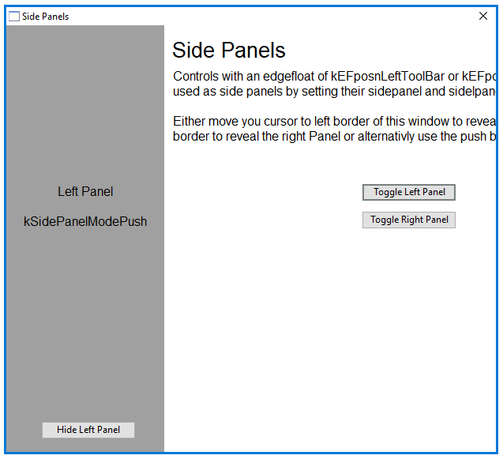

# Omnis-SidePanels

Example library demonstrating animated side panels, as introduced for window classes in Omnis Studio 10.2.

## Contents
### sidepanels
This folder contains the source JSON files for the Omnis library in Github. 

To restore these files in Omnis Studio, click on the Libraries node in the Studio Browser, and click on the New Lib from JSON option. In the New Library (import) dialog, navigate to this source folder (containing library.json), and then specify a different folder or location for the new Library and click on Import. Once imported, either open the Startup_Task or close and re-open the library to run.
